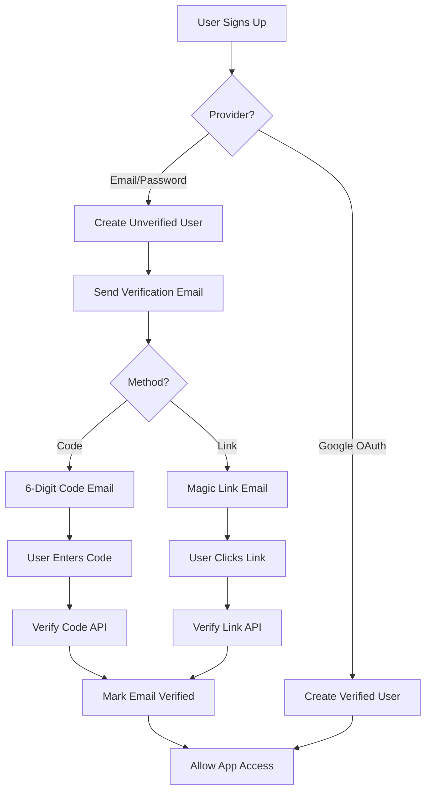

# Email Verification System Implementation

## Overview

Add email verification to the authentication system supporting both verification codes and magic links, using Resend for email delivery. Users must verify immediately after signup before accessing the app, while Google OAuth users are auto-verified.

## Architecture



## Implementation Steps

### 1. Database Schema Updates

**File: `lib/db/schema.ts`**

- Add `emailVerified` boolean field to `users` table (default: false)
- Add `emailVerifiedAt` timestamp field (nullable)
- Create new `emailVerificationTokens` table with:
  - `id` (uuid, primary key)
  - `userId` (uuid, foreign key to users)
  - `token` (text, unique, indexed)
  - `code` (text, nullable, for code-based verification)
  - `type` (text: 'code' | 'link')
  - `expiresAt` (timestamp)
  - `usedAt` (timestamp, nullable)
  - `createdAt` (timestamp)

### 2. Email Service Setup

**New File: `lib/email/resend.ts`**

- Configure Resend client with API key from environment
- Create email template functions:
  - `sendVerificationCode(email, code)` - sends 6-digit code
  - `sendVerificationLink(email, token)` - sends magic link
  - `sendVerificationResend(email, code, link)` - sends both options

**Environment Variables:**

- `RESEND_API_KEY` - Resend API key
- `VERIFICATION_BASE_URL` - Base URL for verification links (defaults to NEXTAUTH_URL)

### 3. Verification Token Management

**New File: `lib/auth/verification.ts`**

- `generateVerificationToken(userId, type)` - creates token/code with expiration
- `validateVerificationToken(token)` - validates and marks as used
- `validateVerificationCode(userId, code)` - validates code
- `cleanupExpiredTokens()` - cleanup function for expired tokens

### 4. API Endpoints

**New File: `app/api/auth/verify/route.ts`**

- `POST /api/auth/verify` - verify using code or token
  - Accepts: `{ code?: string, token?: string }`
  - Validates and marks user as verified
  - Returns success/error

**New File: `app/api/auth/resend-verification/route.ts`**

- `POST /api/auth/resend-verification` - resend verification email
  - Requires authenticated user
  - Generates new token/code
  - Sends email with both methods

**Update: `app/api/auth/signup/route.ts`**

- Remove auto sign-in after signup
- Set `emailVerified: false` for new users
- Send verification email immediately after user creation
- Return user data with `emailVerified: false` flag

**Update: `lib/auth/config.ts`**

- In `signIn` callback: Auto-verify Google OAuth users (`emailVerified: true`)
- In `jwt` callback: Include `emailVerified` in token
- In `session` callback: Include `emailVerified` in session

### 5. Authentication Guards

**Update: `lib/guards.ts`**

- Add `requireEmailVerification` guard function
- Check `emailVerified` status before allowing access
- Return appropriate error response if not verified

**Update: Protected API routes:**

- `app/api/tailor/route.ts` - require verification
- `app/api/export/route.ts` - require verification
- `app/api/billing/*` - require verification

### 6. UI Components

**New File: `components/auth/EmailVerificationModal.tsx`**

- Modal shown after signup or when accessing protected routes
- Supports both verification methods:
  - Code input field (6 digits)
  - Link display with "Check your email" message
- "Resend verification email" button
- Auto-closes when verification succeeds

**Update: `components/auth/SignupModal.tsx`**

- After successful signup, show verification modal instead of auto-signing in
- Display message: "Please verify your email to continue"

**Update: `components/auth/LoginModal.tsx`**

- Check if user is unverified after login
- Show verification modal if `emailVerified: false`

**New File: `app/verify/page.tsx`**

- Standalone verification page for magic links
- Route: `/verify?token=xxx`
- Validates token and redirects to dashboard on success

### 7. Middleware Updates

**Update: `lib/auth/middleware.ts` (if exists) or create new**

- Check verification status for protected routes
- Redirect unverified users to verification flow

**Update: `app/dashboard/page.tsx`**

- Check verification status
- Show verification banner if not verified
- Block access to main dashboard features if unverified

### 8. Type Updates

**Update: `types/next-auth.d.ts`**

- Add `emailVerified: boolean` to `User` interface
- Add `emailVerified` to session user type

## Dependencies

Add to `package.json`:

```json
"resend": "^3.0.0"
```

## Environment Variables

Add to `.env`:

```
RESEND_API_KEY=re_xxxxx
VERIFICATION_BASE_URL=http://localhost:3000  # or production URL
```

## Migration Strategy

1. Existing users: Set `emailVerified: true` by default (grandfather in)
2. New users: Must verify before accessing app
3. Google OAuth: Auto-verified on first sign-in

## Testing Considerations

- Test code verification flow
- Test link verification flow
- Test expired tokens/codes
- Test resend functionality
- Test Google OAuth auto-verification
- Test unverified user access restrictions