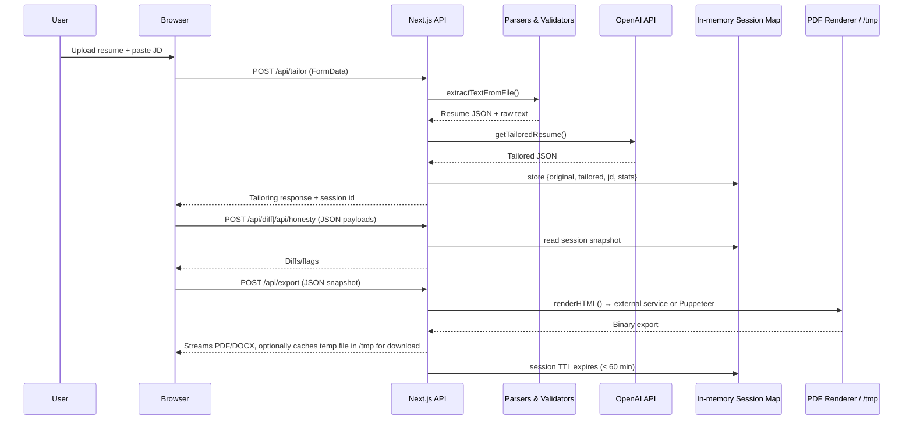

# Data Flow & Privacy Controls

## End-to-End Data Journey

## Storage & Retention

| Artifact                      | Location                     | Retention                     | Notes |
|-------------------------------|------------------------------|--------------------------------|-------|
| Resume raw text               | In-memory session Map        | 60 minutes TTL                | Not written to disk by default |
| Tailored resume JSON          | In-memory session Map        | 60 minutes TTL                | Includes ATS stats + honesty scan |
| Uploaded file binaries        | Memory during request        | Discarded immediately post-parse | No persistent storage; scanned PDFs rejected |
| Export outputs                | Buffer streamed to client    | Optional `/tmp/resume.pdf` until download | File deleted after GET /api/export/[file] |
| Telemetry logs                | `/tmp/*.jsonl` (JSON Lines)  | Ephemeral (tmpfs)             | Can stream to external drain via env vars |
| Config overrides              | `/tmp/ai-resume-tailor-config.json` | Until container restart | Stores admin-edited rate limits, invite list, override key |

## Deletion & Privacy Guarantees

- **Default Non-Persistence:** No resume or JD content persists beyond the in-memory session window unless operator enables external storage.
- **Scanned PDFs:** Detected and rejected early with explicit user messaging (`lib/parsers.ts`).
- **Session Expiry:** `lib/sessions.ts` purges entries older than 60 minutes on every read/write.
- **Export Cleanup:** `/api/export/[file]` removes temp files immediately after download attempt.
- **Telemetry Scrubbing:** Only stores metadata (request ids, timings, coverage metrics). Full payloads are not logged.
- **Invite & Rate Guarding:** `lib/guards.ts` ensures only authorised users can access APIs, reducing exposure risk.

## Optional Hard-Delete Hooks

If stricter guarantees are required:

1. Extend `lib/sessions.ts` with an explicit `destroySession` endpoint invoked when the user leaves the workspace.
2. Mount `/tmp` on tmpfs or container ephemeral storage to guarantee deletion on restart.
3. Pipe telemetry to external logging platform with data retention policies aligned to compliance requirements.

