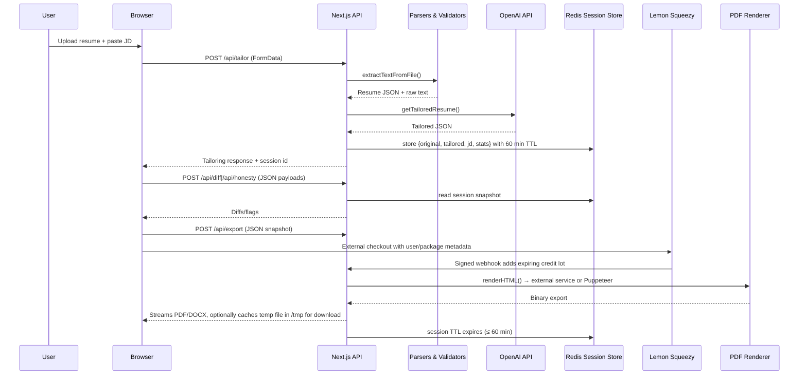

# Data Flow & Privacy Controls

## End-to-End Data Journey

```mermaid
sequenceDiagram
    participant User
    participant Browser
    participant API as Next.js API
    participant Parser as Parsers & Validators
    participant AI as OpenAI API
    participant Session as Redis Session Store
    participant Billing as Lemon Squeezy
    participant PDF as PDF Renderer

    User->>Browser: Upload resume + paste JD
    Browser->>API: POST /api/tailor (FormData)
    API->>Parser: extractTextFromFile()
    Parser-->>API: Resume JSON + raw text
    API->>AI: getTailoredResume()
    AI-->>API: Tailored JSON
    API->>Session: store {original, tailored, jd, stats} with 60 min TTL
    API-->>Browser: Tailoring response + session id
    Browser->>API: POST /api/diff|/api/honesty (JSON payloads)
    API->>Session: read session snapshot
    API-->>Browser: Diffs/flags
    Browser->>API: POST /api/export (JSON snapshot)
    Browser->>Billing: External checkout with user/package metadata
    Billing->>API: Signed webhook adds expiring credit lot
    API->>PDF: renderHTML() → external service or Puppeteer
    PDF-->>API: Binary export
    API-->>Browser: Streams PDF/DOCX, optionally caches temp file in /tmp for download
    API->>Session: session TTL expires (≤ 60 min)
```

## Storage & Retention

| Artifact                      | Location                     | Retention                     | Notes |
|-------------------------------|------------------------------|--------------------------------|-------|
| Resume raw text               | Redis session store          | 60 minutes TTL                | Stored with the session so users can preview/export |
| Tailored resume JSON          | Redis session store          | 60 minutes TTL                | Includes ATS stats + honesty scan |
| Uploaded file binaries        | Memory during request        | Discarded immediately post-parse | No persistent storage; scanned PDFs rejected |
| OpenAI request payloads       | OpenAI API                   | Governed by OpenAI settings   | Resume/JD text is sent for tailoring |
| Credit purchases              | Lemon Squeezy + database     | Account lifetime / accounting | Credits expire 12 months after purchase/grant |
| Export outputs                | Buffer streamed to client    | Request lifetime by default | Legacy `/api/export/[file]` deletes temp files after download |
| Telemetry and analytics       | Database / optional drains   | Operator-controlled           | Stores product metrics, not raw uploaded binaries |

## Deletion & Privacy Guarantees

- **Session-Limited Persistence:** Resume and JD text persists in Redis only for the 60-minute session window.
- **Scanned PDFs:** Detected and rejected early with explicit user messaging (`lib/parsers.ts`).
- **Session Expiry:** `lib/sessions.ts` stores entries with a 60-minute Redis TTL.
- **Export Cleanup:** `/api/export/[file]` removes temp files immediately after download attempt.
- **Telemetry Scrubbing:** Only product metadata should be logged. Full resume/JD payloads must stay out of telemetry.
- **Invite & Rate Guarding:** `lib/guards.ts` ensures only authorised users can access APIs, reducing exposure risk.

## Optional Hard-Delete Hooks

If stricter guarantees are required:

1. Extend `lib/sessions.ts` with an explicit `destroySession` endpoint invoked when the user leaves the workspace.
2. Configure Redis TTL/eviction and provider retention policies for the target compliance posture.
3. Pipe telemetry to an external logging platform with retention policies aligned to compliance requirements.
