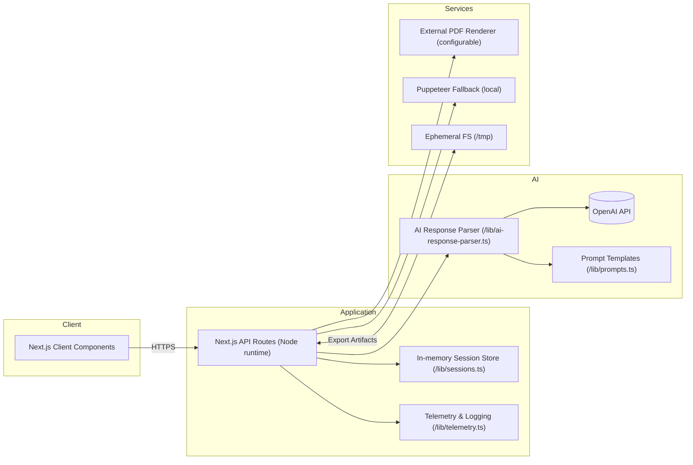

# Technical & Architecture Overview

## High-Level System Context

## Component Breakdown

- **Frontend:** Next.js 14 app directory with client components handling upload, JD input, preview, diffing, and export workflows (`app/page.tsx`, `components/*`).
- **Backend:** Next.js Edge/Node API routes (`app/api/**`) providing resume parsing, tailoring, ATS scoring, honesty scan, diff generation, export, admin configuration, and health checks.
- **AI Layer:** Centralised helper `lib/ai-response-parser.ts` orchestrates OpenAI chat completions, schema validation, coercion, retry logic, and honesty safeguards.
- **Sessions & Privacy:** Session data is stored in-memory (Node Map) with 60-minute TTL; configuration overrides and telemetry persist only to `/tmp`.
- **Exports:** HTML rendering via `lib/pdf-service-v2.ts` with multi-tier fallbacks (external renderer → Puppeteer → basic PDF). DOCX generated through `lib/html-to-docx.ts`.
- **Telemetry & Guardrails:** Invite gating, rate limits, and guard enforcement handled by `lib/guards.ts`. Telemetry records metrics, AI attempts, and errors to JSONL streams.

## Deployment Pipeline

1. **Build:** `npm run build` compiles Next.js, Tailwind CSS, and TypeScript.
2. **Containerisation:** Dockerfile ships a Node 20-alpine image; CI can push to registry.
3. **Runtime Config:** Environment variables set for OpenAI, renderer, invites, admin key, rate limits.
4. **Hosting Options:**
   - **Managed (Vercel):** Leverages `vercel.json` for function memory/timeouts.
   - **Self-hosted VM/K8s:** Run container, expose port 3000 behind TLS proxy.
5. **Observability:** Telemetry logs shipped to `LOG_DRAIN_URL` if configured; alerts triggered via `lib/pdf-monitoring.ts` webhooks.

## Extensibility Considerations

- **Persistence:** Swap `lib/sessions.ts` Map for Redis/PostgreSQL to support multi-instance deployments.
- **AI Provider:** `lib/openai.ts` centralises client creation; alternate providers can be introduced behind the same interface.
- **Multi-Tenant Controls:** Extend `lib/config.ts` to read from durable KV, integrate with SSO for `/admin`.

